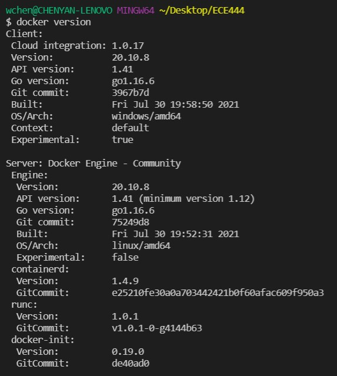
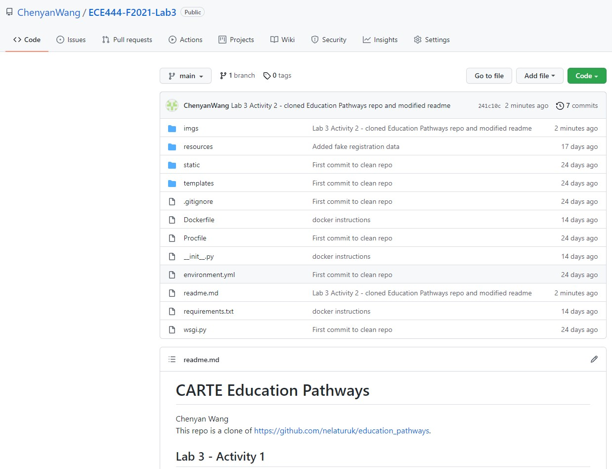
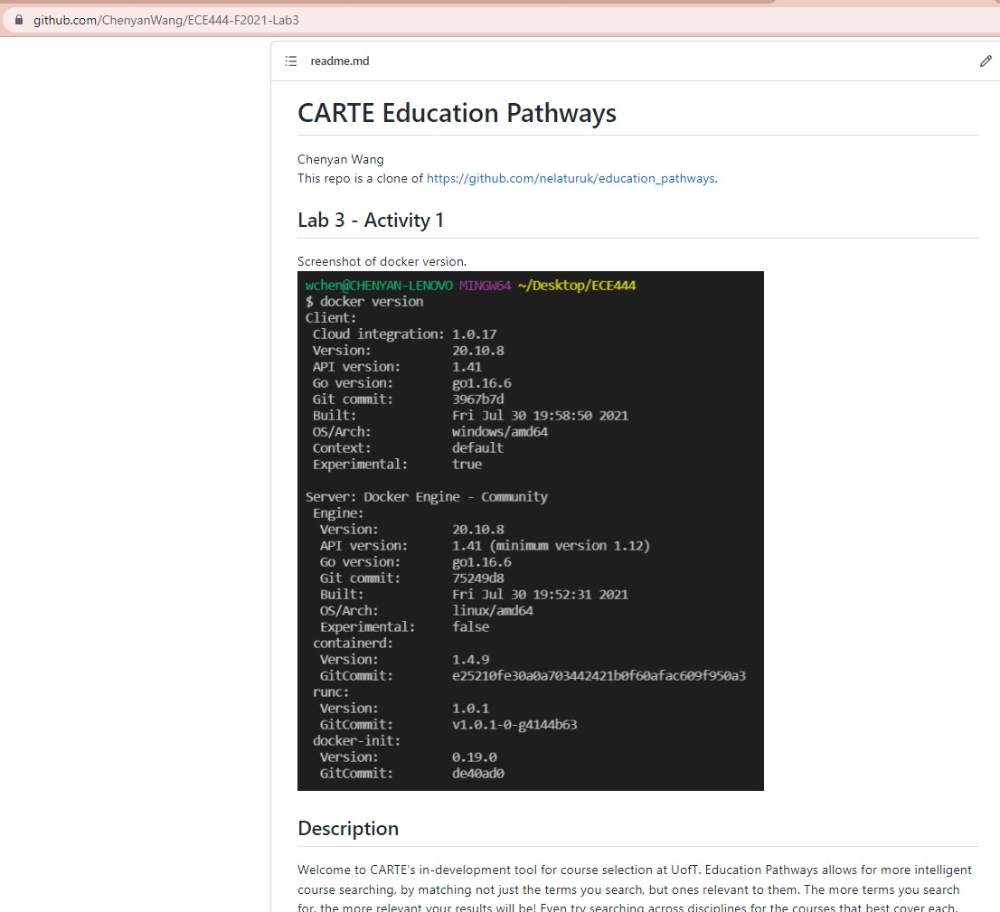
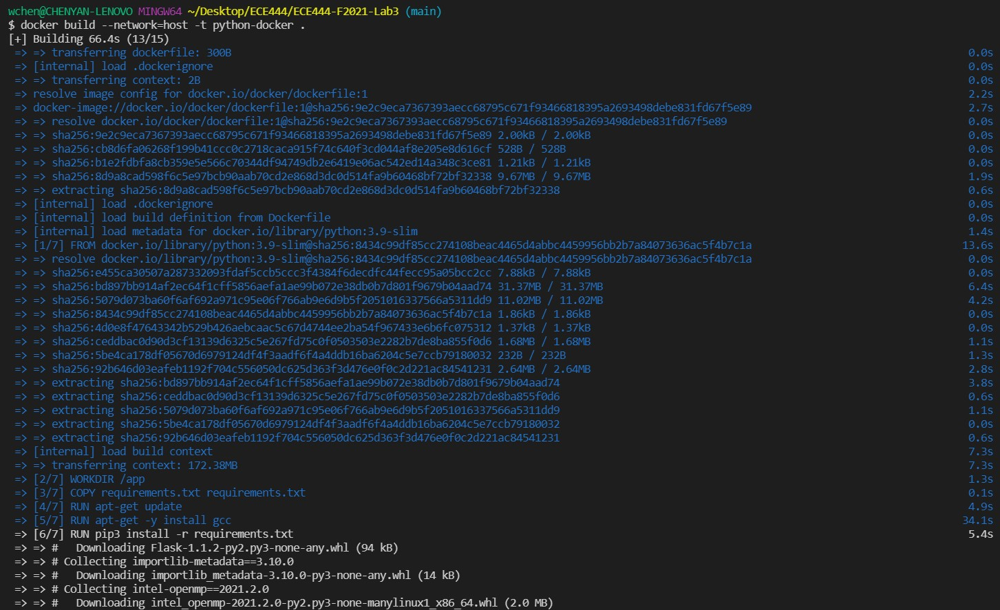
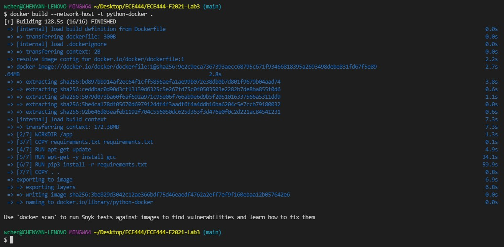
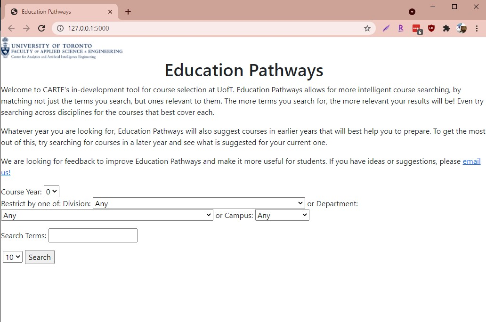
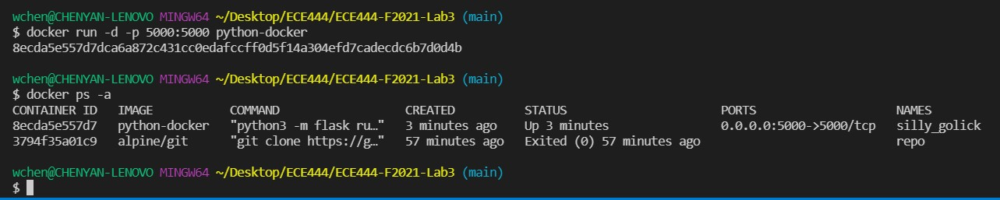

# CARTE Education Pathways

Chenyan Wang  
This repo is a clone of https://github.com/nelaturuk/education_pathways.  

## Lab 3 - Activity 1  
Screenshot of docker version.  
  

## Lab 3 - Activity 2  
Screenshot of cloned repo and updated readme.  
  
Readme: 
  

## Lab 3 - Activity 3  
Screenshot of building the docker image.  
  
Build log after docker image build is complete:  
  

## Lab 3 - Activity 4  
Screenshot of the flask app running and the docker image.  
Flask app:  
  
Docker image:  
  

## Lab 3 - Activity 5  
This section will describe one functional and one non-functional requirement of the system and how they could be improved.  

### Functional Requirement - Search/Filter Function  
Currently there is a filter function that allows the user to filter the search results by division, department or campus. Currently if the user adds a filter to restrict the courses by divison, department, or campus, with an empty search term, no results come up. To improve the search/filter functionality, can list all courses that fit under the division/department/campus if the user puts on a search filter but does not input any search terms. Additionally, can also improve the search term feature by providng autocomplete suggestions and allow for course code lookup.

### Non-Functional Requirement - Usability
Currently the system allows for users to filter searches for courses by course year, and also restrict by division, department or campus. However, this can be very cumbersome if users wanted to look for all courses matching a search term, regardless of course year. For example, if they wanted to search "drama" and get the results for 2nd, 3rd, and 4th year to plan out the remainder of their university degree, they would have to perform 3 individual searches to get the results they want.

## Description
Welcome to CARTE's in-development tool for course selection at UofT. Education Pathways allows for more intelligent course searching, by matching not just the terms you search, but ones relevant to them. The more terms you search for, the more relevant your results will be! Even try searching across disciplines for the courses that best cover each.

Whatever year you are looking for, Education Pathways will also suggest courses in earlier years that will best help you to prepare. To get the most out of this, try searching for courses in a later year and see what is suggested for your current one.

We are looking for feedback to improve Education Pathways and make it more useful for students. If you have ideas or suggestions, please email us!

## Setup Instructions

### With Docker

## Repository files:

`./Procfile ./wsgi.py` *tells gunicorn how to run the program*

`./environment.yml  ./requirements.txt` *specifies python requirements for anaconda and pip respectively*

`./__init__.py` *main flask code*

`./readme.md` *this file*

`./resources:` *contains datasets used in the program*

`course_vectorizer.pickle df_processed.pickle`

`course_vectors.npz       graph.pickle`

`./static:` *contains any static elements of the webpage, in this case just the CARTE logo*
`CARTE_logo.jpg`

`./templates:` *contains flask templates for rendering HTML*

`_formhelpers.html course.html       index.html        results.html`
